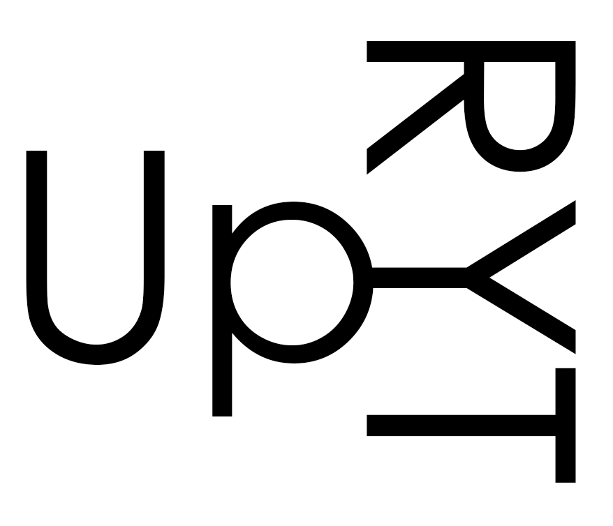

# UPRYT v2 - Real-Time Posture Analysis with Reinforcement Learning



An advanced posture correction system using RL for adaptive feedback.

## Installation

### Option 1: Install as Package (Recommended)
```bash
pip install -e .
```

### Option 2: Install Dependencies Only
```bash
pip install -r requirements.txt
```

## Quick Start

### GUI Application (Recommended)
Simply double-click `run_app.bat` (Windows) or run:
```bash
python gui_app.py
```

The GUI provides easy access to all features:
- Real-Time Monitoring (PPO/DQN/Rule-Based)
- Train RL Agent
- Compare Algorithms

### Command Line Usage

#### 1. Train the RL Agent (Simulation)
```bash
python main.py --mode train --episodes 500
```

#### 2. Compare Methods
```bash
python main.py --mode compare
```

#### 3. Run Real-Time System
```bash
python main.py --mode realtime
```

#### 4. Run with Rule-Based (No RL)
```bash
python main.py --mode realtime --algorithm rule
```

## Project Structure

```
├── config.py          # Centralized configuration
├── pose_module.py     # MediaPipe pose detection
├── posture_module.py  # Posture classification
├── rl_agent.py        # DQN implementation
├── environment.py     # RL environment logic
├── simulation.py      # Training simulator
├── feedback.py        # UI/alerts
├── utils.py           # Helper functions
├── main.py            # Entry point
└── requirements.txt   # Dependencies
```

## How It Works

1. **Pose Detection**: MediaPipe extracts keypoints (nose, shoulders, hips)
2. **Posture Classification**: Rules determine posture quality (good/slouching/forward_head/leaning)
3. **RL Agent (DQN)**: Decides feedback based on state
4. **Actions**: 0=no feedback, 1=subtle alert, 2=strong alert
5. **Rewards**: +10 for corrections, -5 for ignored alerts, -3 for fatigue

## State Representation

The RL agent receives a 6-dimensional state:
- Posture label (encoded)
- Posture score (0-1)
- Duration of bad posture
- Time since last alert
- Recent correction rate
- Consecutive alerts

## Design Decisions

1. **DQN over Q-Table**: Handles continuous/complex state spaces better
2. **Experience Replay**: Stabilizes training
3. **Target Network**: Reduces oscillation
4. **Epsilon-Greedy**: Balances exploration/exploitation
5. **Simulation First**: Trains without real webcam
